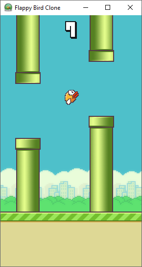

# Flappy Bird Clone

This project is an excercise in game development and a way to test the ins and outs of [Godot Engine](https://godotengine.org/).
- The project is fully non-commerical.
- All the scripts are written in GDScript.
- Developed on Godot Engine v3.5.2

## Screenshot

## Credits
### Assets
- [kosresetr55](https://kosresetr55.itch.io/flappy-bird-assets-by-kosresetr55) (Sprites / Sound Effects)
- [Blagoicons](https://www.deviantart.com/blagoicons/art/Flappy-Bird-Icon-441620977) (Game Icon)